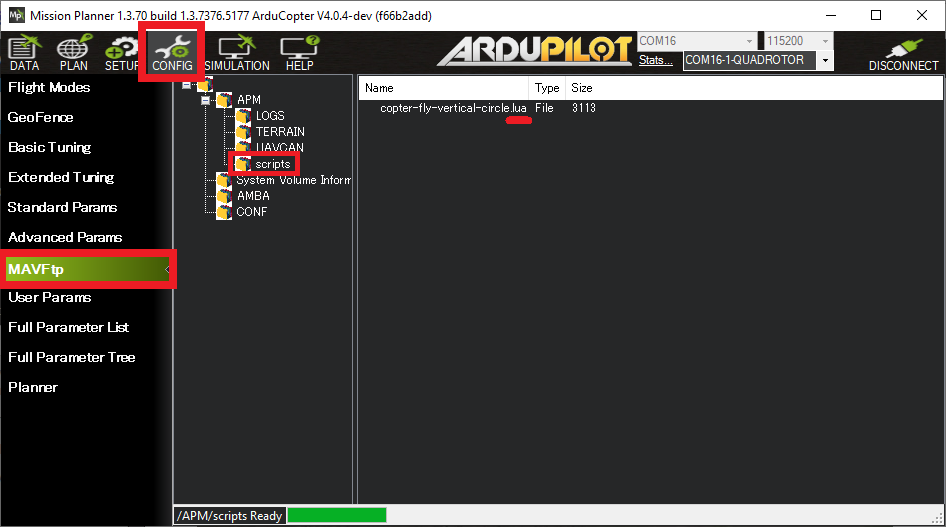

# Dead Reckoning Failsafe LUA Script for ArduCopter
Скрипты хранятся на SD-карте и выполняются параллельно с полетным кодом. Подробнее [здесь](https://ardupilot.org/copter/docs/common-lua-scripts.html "https://ardupilot.org/copter/docs/common-lua-scripts.html").

Доступно [несколько примеров](https://github.com/ArduPilot/ardupilot/tree/master/libraries/AP_Scripting/applets "https://github.com/ArduPilot/ardupilot/tree/master/libraries/AP_Scripting/applets") готовых скриптов.
## Алгоритм:
- После набора высоты 50м начинает работать скрипт
- При потере связи БВС начинает возврат с текущим азимутом назад (наклоном по тангажу) без использования GPS в режиме GUIDED_NO_GPS в течении таймаута (60сек) и уносится ветром
- После восстановления связи управление возвращается оператору
- если по истечении таймаута связь не восстановилась, дрон переходит в режим удержания высоты и уносится ветром
## Недостатки:
- отсутствует упреждение на ветер
- отсутствует проверка наличия GNSS
## Вопросы
- прятать скрипт в кастомной прошивке
- объем памяти, выделенной для скрипта
## TODO
- Требуется Очистка кэша после дизарма. Скрипт не заработал после второго арма
- Требуется отладить алгоритм работы скрипта при потере связи на возврате домой
- при отсутствии GPS, связи и таймаут вывести дрон в ALtHold. При наличии в RTL. Проверка качества GNSS-сигнала.
- Инструкция по работе с симулятором
- активация на высоте >60м и изучить, когда летают с возвышенности
- Разобраться с буфером, который заполнился через 15минут после начала полета. Запись AHRS не в буфер, а на microSD-карту.
- сценарий работы скрипта, когда видеосигнала уже нет, но связь сохраняется.
## Проверка в симуляторе
### Симулятор SITL в Mission Planner:
Запуск mavproxy:
`mavproxy --master=tcp:127.0.0.1:5763 --console`

Команды:

Отключение RC:
`param set SIM_RC_FAIL 1`

Отключение GNSS:
`param set SIM_GPS_DISABLE 1`
## Запуск скрипта в прошивке ArduPilot
* Установите **SCR_ENABLE, 1**, чтобы включить скрипты (обновите или перезагрузите полетный контроллер, чтобы увидеть все параметры **SCR_**).
* Загрузите скрипты (файлы с расширением .lua) на SD-карту полетного контроллера в папку **APM/scripts**.
    * Если этой папки нет на SD-карте, вы можете ее создать, выставив **SCR_ENABLE, 1** и перезагрузив полетный контроллер (выполнив **reboot**).
    Эта папка может быть также создана вручную.
    * В Mission Planner это делается через **CONFIG → MAVFTP**
    * При использовании симулятора папка **scripts** находится в каталоге, из которого был запущен симулятор. MAVFTP будет работать и в этом случае.


* Установите **SRTL_POINTS, 0** и **TERRAIN_ENABLE, 0** для выделения бОльшего количества памяти для скрипта.
* Установите **SCR_HEAP_SIZE, 665600** (хватит на 14 минут) для выделения необходимого количества памяти для скрипта.
* Установите **INS_LOG_BAT_MASK,0** для освобождения оперативной памяти от задачи записывать IMU Batch Sampling, который используется для FTT-анализа.
## Debug
Скорость записи примерно 500Bps (запись 3 чисел 10раз в секунду). Одно число весит 16B.

**SCR_HEAP_SIZE, 204800** - 200kB | 10Hz хватает на 6мин 50сек

**SCR_HEAP_SIZE, 409600** - 400kB | 10Hz хватает на 13мин 40сек

**SCR_HEAP_SIZE, 665600** - 650kB | 10Hz хватает на 13мин 41сек

**SCR_HEAP_SIZE, 409600** - 400kB | 5Hz хватает на 68мин 17сек
### Вывод
- Размер памяти, выделяемой для скрипта в параметре **SCR_HEAP_SIZE** более 400kB, не влияет на время логгирования 3 чисел в данном скрипте при частоте записи 10Hz.
# Сделано
## 2024-11-19
- Изменены параметры ArduCopter, из-за которых доступной оперативной памяти могло быть меньше необходимого, но в конечном итоге это не повлияло на размер буфера для кэширования данных об ориентации БВС:
```
INS_LOG_BAT_MASK,0
SRTL_POINTS, 0
```

## 2024-11-20
- Снижена частота кэширования в скрипте с 10Hz до 5Hz
```
SCR_HEAP_SIZE, 409600 - 400kB | 5Hz хватает на 68мин 17сек
```
